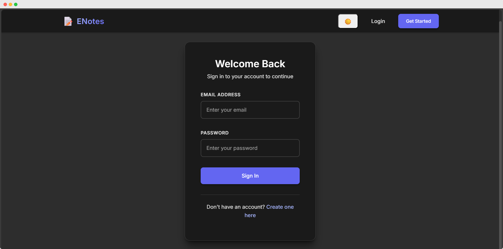

# 📝 ENotes - Modern Note-Taking App

A beautiful, full-stack note-taking application built with the MERN stack. Create, edit, and organize your thoughts with a clean interface that features dark/light mode switching.

## ✨ Features

- 🌙 **Dark/Light Mode** - System preference detection with manual toggle
- 📱 **Responsive Design** - Works on all devices
- 📝 **Note Management** - Create, edit, delete notes with real-time updates
- 🔐 **Authentication** - Secure JWT-based login/registration
- 🎨 **Modern UI** - Clean interface with smooth animations

## 🛠️ Tech Stack

**Frontend:** React 19, React Router, Axios, CSS3
**Backend:** Node.js, Express.js, MongoDB, Mongoose, JWT, bcryptjs
**Development:** Create React App, CORS, dotenv

## 🚀 Quick Start

### Prerequisites
- Node.js (v14+), MongoDB, npm/yarn

### Installation & Setup

1. **Clone and setup backend**
   ```bash
   git clone https://github.com/yourusername/enotes-mern.git
   cd enotes-mern/backend
   npm install
   ```

2. **Create backend `.env` file**
   ```env
   MONGO_URL=mongodb://localhost:27017/enotes
   JWT_SECRET=your-secret-key
   PORT=5000
   FRONTEND_URL=http://localhost:3000
   ```

3. **Setup frontend**
   ```bash
   cd ../frontend/notes-app
   npm install
   ```

4. **Create frontend `.env` file**
   ```env
   REACT_APP_API_URL=http://localhost:5000
   ```

5. **Run the application**
   ```bash
   # Terminal 1 - Backend
   cd backend && npm run dev

   # Terminal 2 - Frontend
   cd frontend/notes-app && npm start
   ```

6. **Access at** `http://localhost:3000`

## 📸 Screenshots

| View | Light Mode | Dark Mode |
|------|------------|-----------|
| **Login Page** |  |  |
| **Register Page** |  |  |
| **Notes Dashboard** |  |  |


## 🔮 Future Features

- [ ] Rich text editor
- [ ] Note categories/tags
- [ ] Search functionality
- [ ] Note sharing
- [ ] Offline support
- [ ] Export to PDF/Markdown

**Made with ❤️ | Give it a ⭐ if helpful!**
